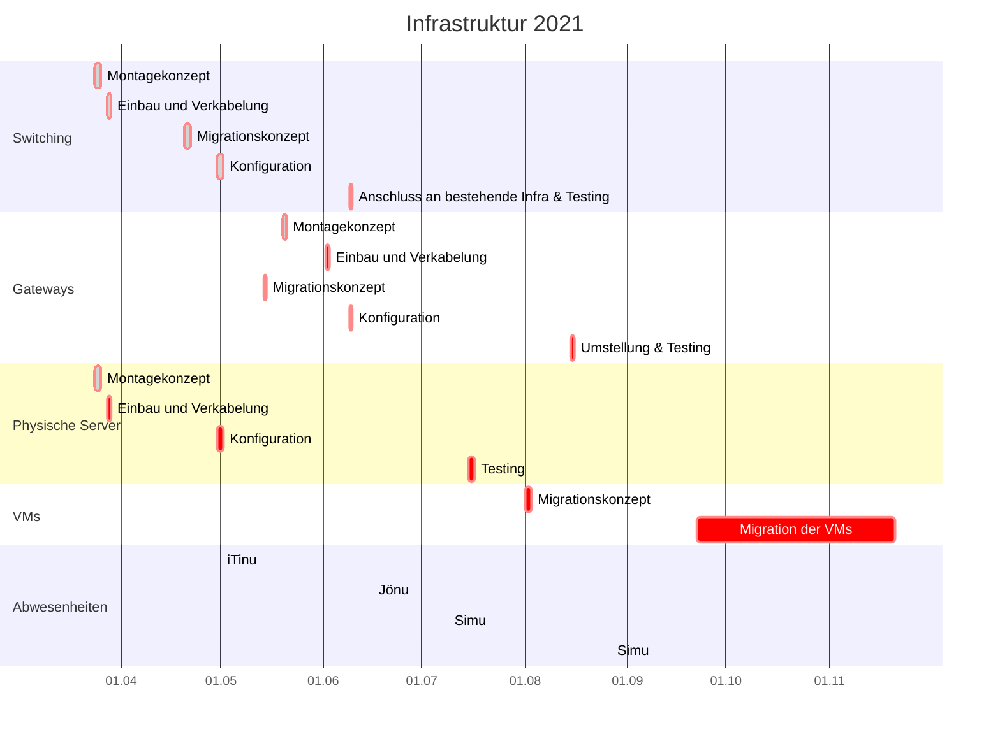

```mermaid
gantt
  axisFormat %d.%m
  title Infrastruktur 2021

  Section Switching
  Montagekonzept                :crit,done, sw1, 2021-03-24, 2d
  Einbau und Verkabelung        :crit,done, sw2, 2021-03-28, 1d
  Migrationskonzept             :crit,done, sw3, 2021-04-20, 2d
  Konfiguration             :crit,done,mt1, 2021-04-30, 2d
  Anschluss an bestehende Infra & Testing   :crit,mt1, 2021-06-09, 1d

  Section Gateways
  Montagekonzept       :crit,done,gw1, 2021-05-20, 1d
  Einbau und Verkabelung :crit, gw2, 2021-06-02, 1d
  Migrationskonzept    :crit, gw3, 2021-05-14, 1d
  Konfiguration        :crit, gw4, 2021-06-09, 1d
  Umstellung & Testing            :crit, gw5, 2021-08-15, 1d

  Section Physische Server
  Montagekonzept                :crit,done, srv1, 2021-03-24, 2d
  Einbau und Verkabelung        :crit, srv2, 2021-03-28, 1d
  Konfiguration             :crit,srv4,2021-04-30, 2d
  Testing                   :crit,srv5,2021-07-15, 2d
  
  Section VMs
  Migrationskonzept             :crit, vm1, 2021-08-01, 2d
  Migration der VMs             :crit, vm2, 2021-09-22, 60d

  Section Abwesenheiten
  iTinu             :crit,a1, 2021-05-01,2021-05-31
  Jönu            :crit,a2, 2021-06-16,2021-07-01
  Simu           :crit,a3, 2021-07-09,2021-07-25
  Simu           :crit,a3, 2021-08-27,2021-09-1
```
